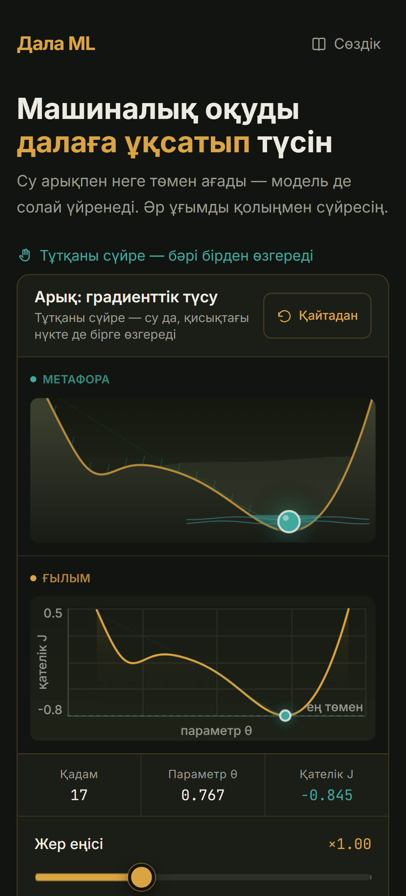
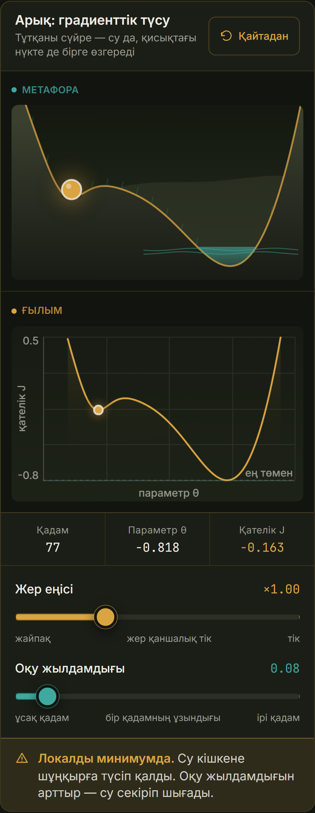
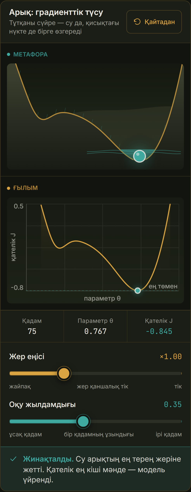
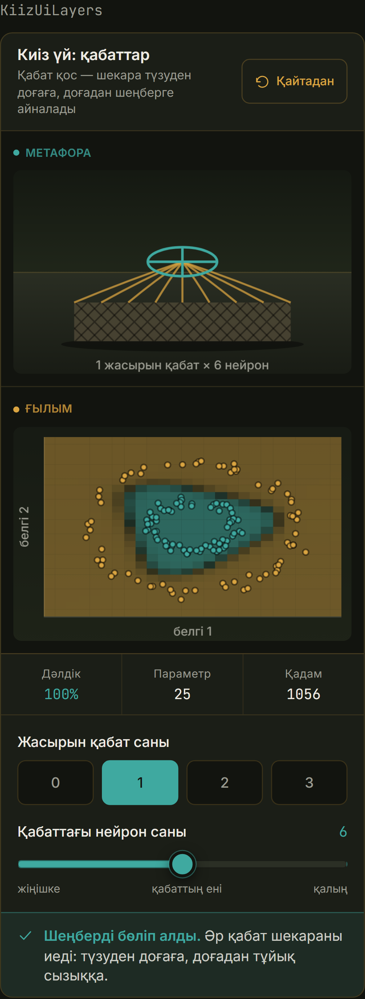
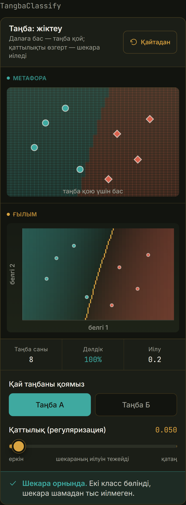
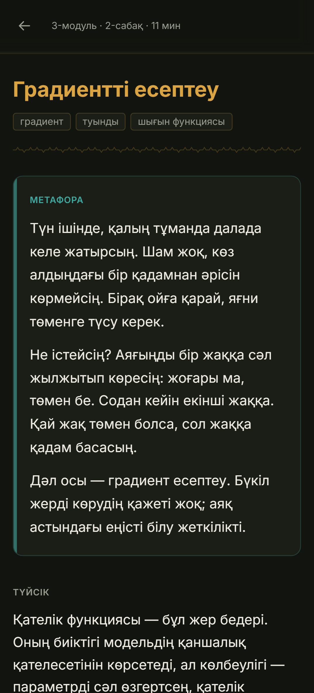

# Дала ML

Первый курс машинного обучения на казахском языке — для сельского школьника с дешёвым Android
и нестабильным интернетом.

Каждое понятие объясняется через степной образ, который ребёнок знает с детства: вода в арыке,
отара на жайлау, слои киіз үй. И каждое понятие можно **потрогать пальцем**: восемь интерактивов,
где ты двигаешь ползунок в метафоре — и синхронно меняется настоящий график.

Прод: **https://dala-ml.vercel.app**

## Что внутри

- **3 модуля, 10 уроков** на казахском, ритм каждого: Метафора → Түйсік → Ғылыми тілмен →
  Интерактив → Тексеру.
- **8 интерактивов** на чистом Canvas. Никаких чарт-библиотек, никакой «декоративной анимации»:
  под каждым виджетом настоящая модель, которая считается на устройстве.
- **Словарь на 82 термина**: казахское объяснение, английский оригинал и степная метафора.
- **Прогресс без регистрации** — localStorage, экспорт/импорт JSON.
- **Работает офлайн**: скачал модуль → выключил сеть → урок и интерактив живые.
- Бэкенда и базы данных нет. Осознанно.

## Скриншоты

| Главная | «Арық»: застрял | «Арық»: сошёлся |
|---|---|---|
|  |  |  |

| Киіз үй (нейросеть) | Таңба (классификация) | Урок |
|---|---|---|
|  |  |  |

## Интерактивы: что считается по-настоящему

| Виджет | Модель под капотом | Что показывает |
|---|---|---|
| `AryqGradient` | градиентный спуск по рельефу с двумя ямами | сходится / застрял в локальном минимуме / разошёлся |
| `OverfitField` | полиномиальная регрессия, степени 1–12 | train-ошибка вниз, test-ошибка вверх, точка перелома |
| `ZhailauQystau` | кривая обучения по размеру выборки | разрыв train/test сокращается с ростом данных |
| `TangbaClassify` | логистическая регрессия с квадратичными признаками и L2 | граница решения, регуляризация распрямляет её |
| `OtarBatch` | SGD по мини-батчам | дрожание траектории ∝ 1/√B |
| `KiizUiLayers` | MLP 2→h…→1, backprop прямо в браузере | слои превращают прямую в замкнутую границу |
| `DalaZheliNoise` | МНК по зашумлённым данным | шум ломает оценку, данные её чинят |
| `FeaturePrimeta` | логрегрессия на подмножестве признаков | признаки решают больше, чем модель |

Вся математика вынесена в `lib/sim/` и покрыта тестами — цифры на экране не подрисованы.

## Команды

```bash
npm run dev           # разработка
npm run build         # сборка (статический экспорт в dist/)
npm run typecheck     # строгая проверка типов
npm run test          # unit-тесты (Vitest) — математика виджетов
npm run e2e:mobile    # e2e в мобильном вьюпорте (Playwright, Pixel 5)
npm run e2e:offline   # офлайн-проверка на собранном dist/
npm run prod:verify   # проверка боевого стенда по SPEC §9
npm run shots         # перегенерировать скриншоты для README
npm run icons         # перегенерировать иконки PWA
```

Локальная проверка сборки целиком:

```bash
npm run build && npm run serve:dist
```

## Структура

```
app/                     маршруты App Router
  kurs/module-N/lesson-M   страницы уроков
  mugalimge/               план занятий для учителя
  sertifikat/              сертификат, рисуется на устройстве
  dev/                     служебные страницы (на проде закрыты)
components/
  interactive/           восемь виджетов
    _shared/             Canvas, Slider, WidgetFrame, палитра, помощники рисования
  lesson/                LessonShell, LessonPage, Quiz
  ui/icons.tsx           единый набор SVG-иконок (эмодзи в интерфейсе запрещены)
lib/
  content.ts             реестр курса: модули, уроки, порядок
  progress.ts            прогресс в localStorage (dala:progress:v1)
  glossary.ts            словарь терминов
  sim/                   математика виджетов, без React
scripts/                 prod-verify, генератор иконок, статический сервер
tests/                   Vitest: модели и датасеты
e2e/                     Playwright: интерактивы, прогресс, офлайн, скриншоты
docs/                    PRD, SPEC, PLAN, DESIGN, скриншоты
```

## Как добавить урок

1. Добавь запись в массив `lessons` в `lib/content.ts` — это единственный источник правды
   о том, какие уроки существуют, как называются и сколько читаются.
2. Создай `app/kurs/module-N/lesson-M/page.tsx` по образцу существующего:

```tsx
'use client'
import { LessonPage } from '@/components/lesson/LessonPage'
import { Formal, Formula, Intuition, Metaphor, Note } from '@/components/lesson/LessonShell'
import type { QuizQuestion } from '@/components/lesson/Quiz'

const questions: QuizQuestion[] = [ /* 3–5 вопросов, разбор у КАЖДОГО варианта */ ]

export default function Page() {
  return (
    <LessonPage slug="module-N-lesson-M" questions={questions} widget={<Виджет />}>
      <Metaphor>…</Metaphor>
      <Intuition>…</Intuition>
      <Formal term="Термин (english)">…</Formal>
    </LessonPage>
  )
}
```

3. Термины из урока добавь в `lib/glossary.ts`.
4. Прогони `npm run typecheck && npm run test && npm run e2e:mobile`.

Правила текста: ни одного экрана подряд без визуала; абзац длиннее пяти строк — разбей;
в интерфейсе только казахский (комментарии в коде — русские, это язык разработки проекта).

## Требования к качеству

Полный список — в `CLAUDE.md` и `docs/SPEC.md`. Коротко:

- mobile-first, вёрстка от 360px, ни одного горизонтального скролла;
- зоны нажатия ≥ 44×44px, интерактивы работают пальцем;
- первая загрузка < 200 КБ JS (сейчас ~155 КБ сжато);
- `prefers-reduced-motion` уважается, холсты вне экрана не тратят кадры;
- эмодзи как иконки запрещены, светлая тема в MVP не поддерживается.

## Лицензия

MIT
